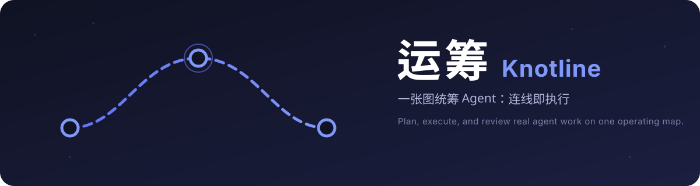

<div align="center">



<br/><br/>

[](LICENSE)
[](package.json)
[](docs/compatibility.md)

**English** · [简体中文](README.zh-CN.md)

</div>

---

Knotline (**运筹**) is a project operating map plugin for the DeepSeek Harness sidebar. The product has one surface: the Map. Requests, agents, project knowledge, execution, delivery, and review live on the same canvas — there is no task list, board, dashboard, timeline, or separate operations console. **Connecting two nodes is a command: the line runs real agent work.**

## Highlights

- **Draw a line, run an agent** — connect a Request to an Agent and classification derives an Answer for questions, Review Feedback then Plan for complex work, or a live Task Bench for Debug in your workspace.
- **Six root node types** — Request, Agent, Skill, Backlog, Approval Pool, and Scheduled Trigger. Everything else (answers, plans, teams, reviews, deliveries) grows on the map by itself.
- **Chat-grade visibility** — running Task Benches expose a live transcript of the agent conversation; finished work carries the agent's full reply, delivery summary, and validation evidence.
- **Reports read like posts** — Work Reports open as fullscreen pages with Markdown, text annotation, and comments that are relayed back to the producing agent.
- **Governed by design** — execution flows through a pre-review artifact and an independent reviewer; self-approval is rejected by the backend.
- **Teams, queues, and schedules** — connect Agents to form Teams, queue work through Backlog and Approval pools, and drive recurring prompts with Host-owned Scheduled Triggers.

## The workflow

1. Pick an existing DeepSeek Harness workspace on the fullscreen picker.
2. Drag root nodes from the top drawer; a Request opens the blurred composer and lands as an island — nothing executes yet.
3. Connect the Request to an Agent. The line classifies the work and starts a real, resumable DSH conversation.
4. Watch the run live, annotate the report it produces, and let the independent review gate carry it to Delivery.

## Run

```powershell
npm install
npm run build
npx @deepseek-ai/dsh@0.1.0-rc.6 plugin --profile web add (Resolve-Path .).Path
npx @deepseek-ai/dsh@0.1.0-rc.6 web
```

Open the URL printed by DSH and select **运筹 / Knotline** in the sidebar. The Map renders inside the DSH plugin layer; there is no standalone page.

## Verify

```powershell
npm run check
npm run pack:check
```

See the Chinese [product requirements document](docs/PRD.md), [docs/architecture.md](docs/architecture.md) for the runtime path, and [docs/development.md](docs/development.md) for local development.

## License and provenance

Knotline is licensed under the [Apache License 2.0](LICENSE). It descends from the Dashi Taskboard codebase; [PROVENANCE.md](PROVENANCE.md) records what was carried forward and [NOTICE](NOTICE) carries the required attribution. Bundled third-party code is listed in [THIRD_PARTY_NOTICES.md](THIRD_PARTY_NOTICES.md). Knotline is an independent community project and is not affiliated with, sponsored by, or endorsed by DeepSeek or the upstream Dashi Taskboard authors. Product names are used only to describe interoperability.
